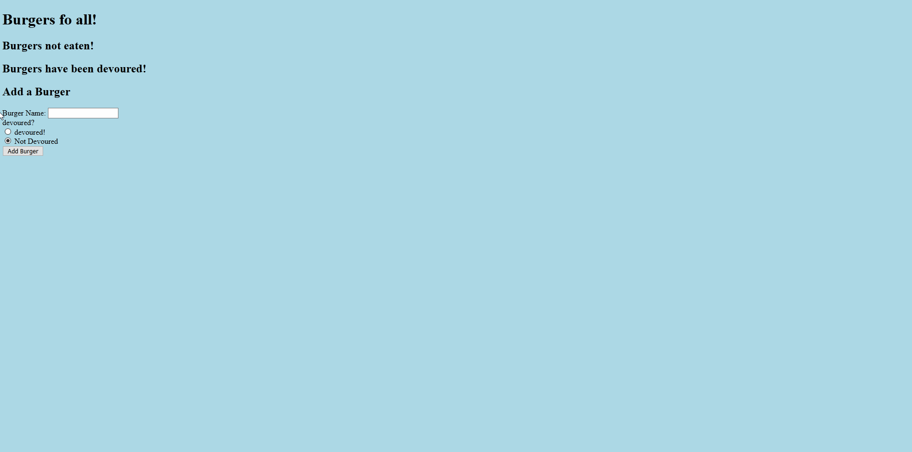

#  Burger Handlebars App**

## **Description**

> The user is presented with a variety of burgers from the burger database. They are able to move burgers from the "to eat" list to the "eaten" list, and visa versa. The user is also allowed to create a new burger of their choosing or delete any existing burger from the database.

## **Preview**

## **Table of Contents**

1. [Installation](#installation)
1. [Usage](#usage)
1. [License](#license)
1. [Questions](#questions)
1. [Preview](#preview)

## **Installation**

> Install dependencies by entering "npm install" into the command line. Create a local database with the given schema and seed file using MySQL.

## **Usage**

> Open VSC in the root terminal run npm i 

> Move to root folder and run nodemon server.js

## **License**

> None

## **Questions**

Find me on GitHub at https://github.com/natewinter.

Contact me via email at joshbrown2794@gmail.com

